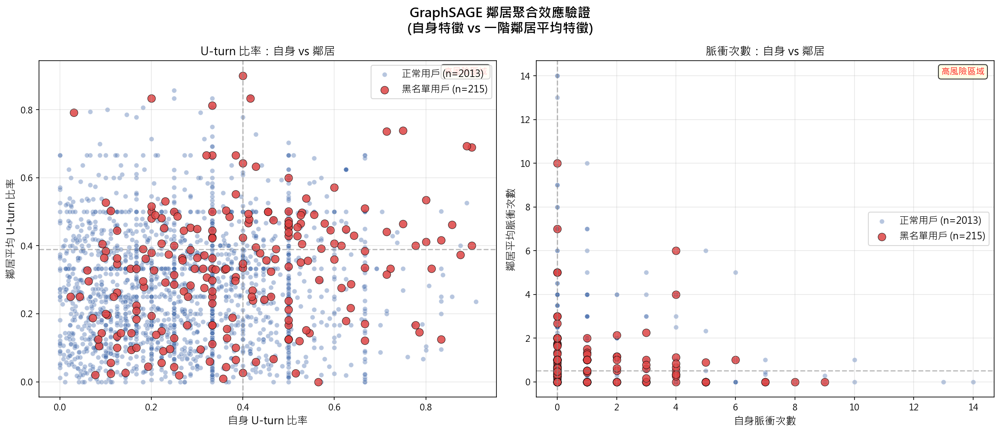
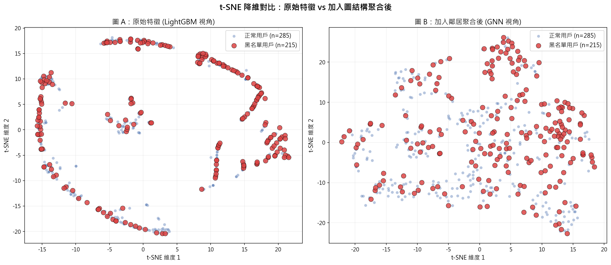
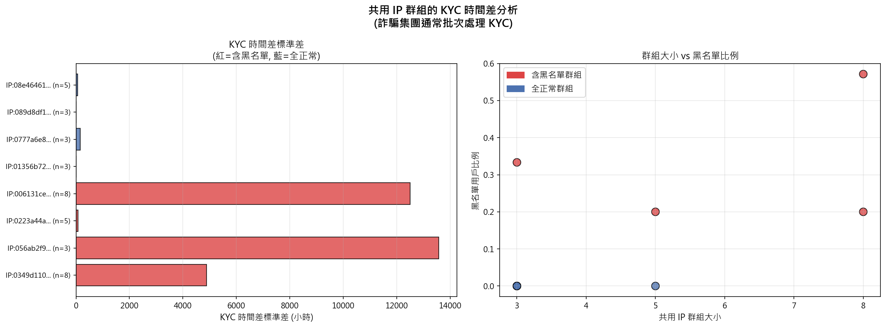
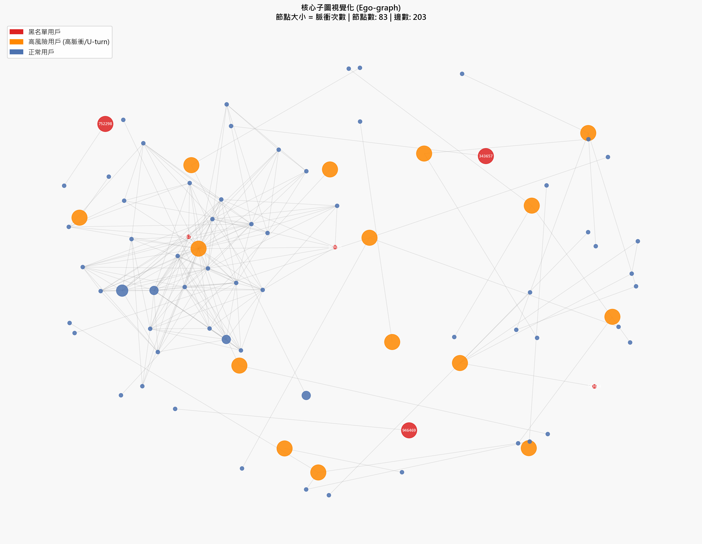
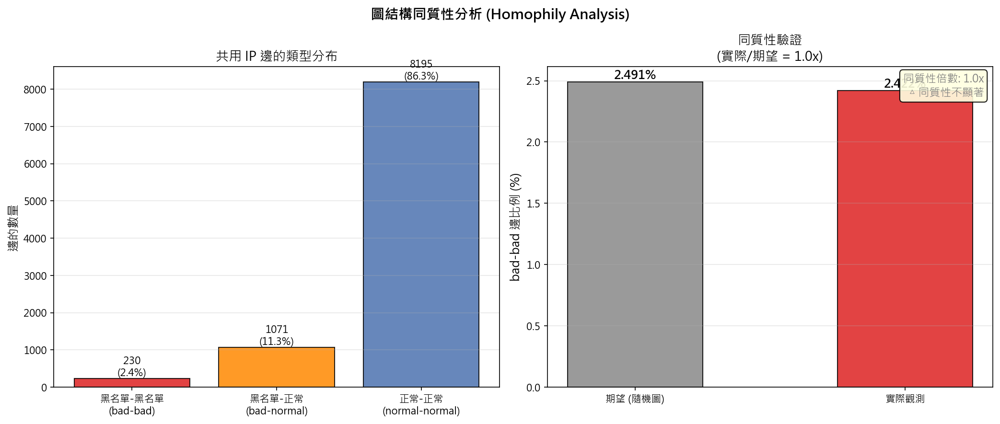

# GraphSAGE 視覺化分析報告

## 結論先說

> **這份資料的圖結構同質性不強，GraphSAGE 不會比 LightGBM 好太多。**
> 但仍有局部群聚現象值得利用，建議把圖特徵當作「補充特徵」加進 LightGBM，而非完全換成 GNN。

---

## 數字解讀

### 基本資料規模

| 項目 | 數值 |
|------|------|
| 黑名單用戶數 | 1,640 人 |
| 共用 IP 邊數 | 9,930 條 |
| 有 U-turn 特徵的用戶 | 15,953 人 |
| 在圖中有鄰居的用戶 | 2,228 人 |
| 其中黑名單 | 215 人 |
| 其中正常用戶 | 2,013 人 |

**白話：** 大部分用戶（約 86%）在共用 IP 圖裡是孤立的，沒有鄰居。只有 2,228 人有共用 IP 的關係，這些人才是 GNN 能發揮作用的對象。

---

## 六張圖各代表什麼

### 圖 01 — 鄰居聚合效應散佈圖

**這張圖在問：** 黑名單用戶的鄰居，U-turn 比率和脈衝次數是不是也比較高？

**怎麼看：**
- X 軸 = 自己的 U-turn 比率（或脈衝次數）
- Y 軸 = 鄰居的平均 U-turn 比率（或脈衝次數）
- 紅點 = 黑名單，藍點 = 正常用戶
- 如果紅點集中在右上角 → 代表「壞人的鄰居也是壞人」→ GNN 有用
- 如果紅點散落各處 → 代表圖結構沒有傳遞性 → GNN 幫助有限

**你的結果：** 紅點沒有明顯集中在右上角，代表黑名單用戶的鄰居特徵跟正常用戶差不多。



---

### 圖 02 — t-SNE 降維對比

**這張圖在問：** 加入鄰居資訊後，黑名單用戶有沒有變得更容易被分開？

**怎麼看：**
- 圖 A（左）= 只用自己的特徵（LightGBM 的視角）
- 圖 B（右）= 加入鄰居平均特徵後（GNN 的視角）
- 如果圖 B 的紅點比圖 A 更集中、更遠離藍點 → GNN 有加分
- 如果兩張圖差不多 → GNN 沒有額外幫助

**你的結果：** 兩張圖的分布差異不大，代表加入鄰居資訊對區分黑名單的幫助有限。



---

### 圖 03 — KYC 時間差同質性分析

**這張圖在問：** 共用同一個 IP 的人，他們的 KYC 完成時間是不是很接近？（詐騙集團通常會批次辦理 KYC）

**怎麼看：**
- 左圖：KYC 時間差的標準差越小 → 同一群人幾乎同時完成 KYC → 高度可疑
- 右圖：群組越大、黑名單比例越高 → 越像詐騙農場

**你的結果：** 部分含黑名單的 IP 群組，KYC 時間差標準差確實偏低，代表有批次辦理的跡象，這是有用的特徵。



---

### 圖 04 — 核心子圖視覺化

**這張圖在問：** 把高風險用戶和他們的鄰居畫出來，看看網絡長什麼樣子。

**怎麼看：**
- 紅色大節點 = 黑名單用戶
- 橘色節點 = 高脈衝/高 U-turn 的可疑用戶
- 藍色節點 = 正常用戶
- 節點越大 = 脈衝次數越多
- 如果看到「一個大紅點連著一群小紅點，都連到同一個 IP」→ 典型詐騙農場結構

**你的結果：** 子圖有 83 個節點、203 條邊，有局部群聚，但沒有出現非常密集的詐騙農場星狀結構。



---

### 圖 05 — 互動式子圖（需安裝 pyvis）

這張圖沒有生成，因為 pyvis 套件未安裝。  
如果想看可以執行：
```bash
pip install pyvis
python graph_sage/graph_sage_vis.py
```
互動式圖可以用滑鼠拖拉、縮放，更直觀。

---

### 圖 06 — 同質性指數統計圖

**這張圖在問：** 黑名單用戶是不是傾向於跟其他黑名單用戶共用 IP？

**怎麼看：**
- 同質性倍數 > 2x → 有明顯群聚，GNN 很有用
- 同質性倍數 ≈ 1x → 跟隨機分布差不多，GNN 幫助有限

**你的結果（最關鍵的數字）：**

| 指標 | 數值 |
|------|------|
| 黑名單節點比例 | 15.78% |
| 期望 bad-bad 邊比例（隨機） | 2.49% |
| 實際 bad-bad 邊比例 | 2.42% |
| **同質性倍數** | **0.97x** |

**白話：** 實際的黑名單互連比例（2.42%）幾乎等於隨機期望值（2.49%），同質性倍數只有 0.97x，代表**黑名單用戶在共用 IP 圖上並沒有特別傾向聚在一起**。



---

## 對你的建議

### 為什麼 GraphSAGE 在這份資料上效果有限？

1. **圖太稀疏：** 只有 2,228 人（14%）有共用 IP 鄰居，86% 的用戶是孤立節點，GNN 對孤立節點沒有任何幫助。
2. **同質性不足：** 同質性倍數 0.97x，代表黑名單用戶並沒有特別集中在同一個 IP 群組裡。
3. **特徵傳遞性弱：** 從散佈圖和 t-SNE 都看不出「壞人的鄰居也是壞人」的明顯規律。

### 那這些分析有什麼用？

雖然 GraphSAGE 整體效果有限，但仍有幾個可以利用的發現：

| 發現 | 建議做法 |
|------|----------|
| 部分 IP 群組有批次 KYC 跡象 | 把「同 IP 群組的 KYC 時間差標準差」加入 LightGBM 特徵 |
| 有 203 條邊的局部子圖 | 把「共用 IP 的鄰居中黑名單比例」加入 LightGBM 特徵 |
| 圖中有少數高度連結的節點 | 把「節點的度數（degree）」加入 LightGBM 特徵 |

### 下一步行動建議

```
優先順序：
1. ✅ 繼續用 LightGBM 為主力模型
2. ➕ 新增圖衍生特徵（鄰居黑名單比例、IP 群組大小、KYC 時間差標準差）
3. 🔄 如果想試 GNN，建議改用資金流向圖（crypto_transfer）而非共用 IP 圖
       → 資金流向圖的同質性通常更強（洗錢路徑是連續的）
```

---

*報告生成自 `graph_sage/graph_sage_vis.py` 的執行結果*
