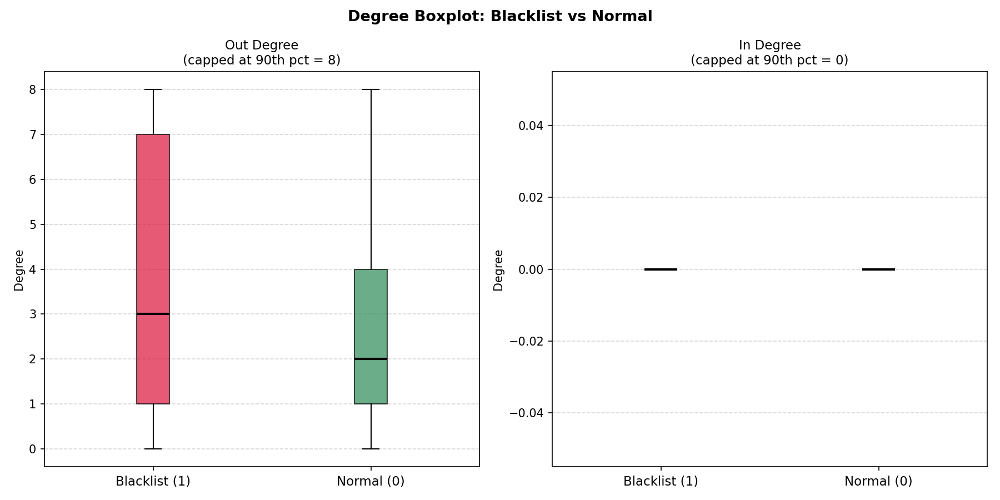
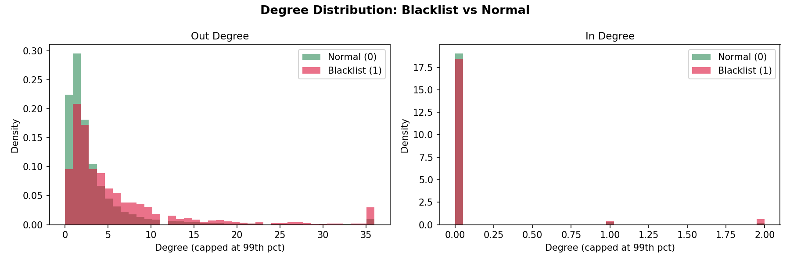
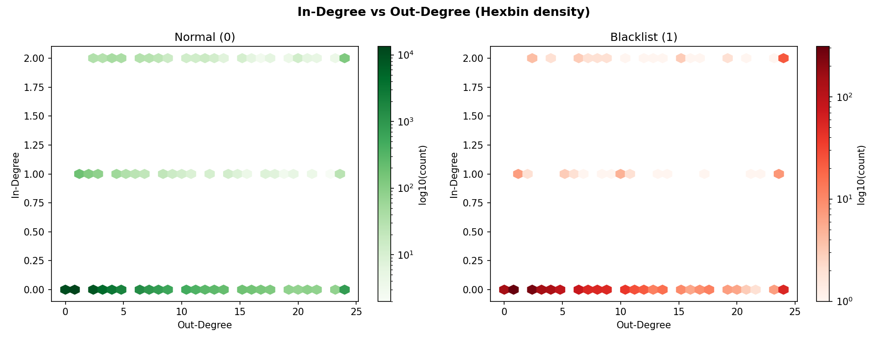
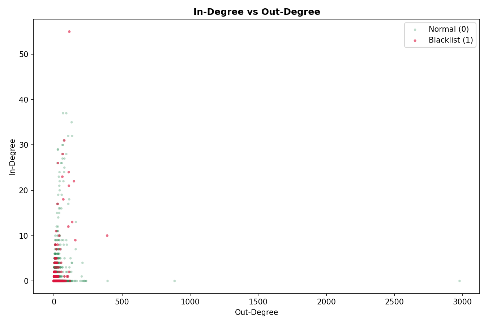
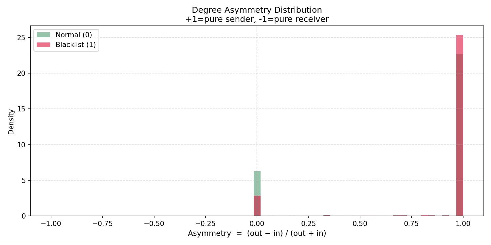
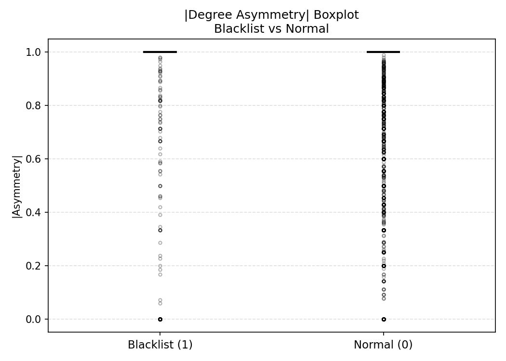
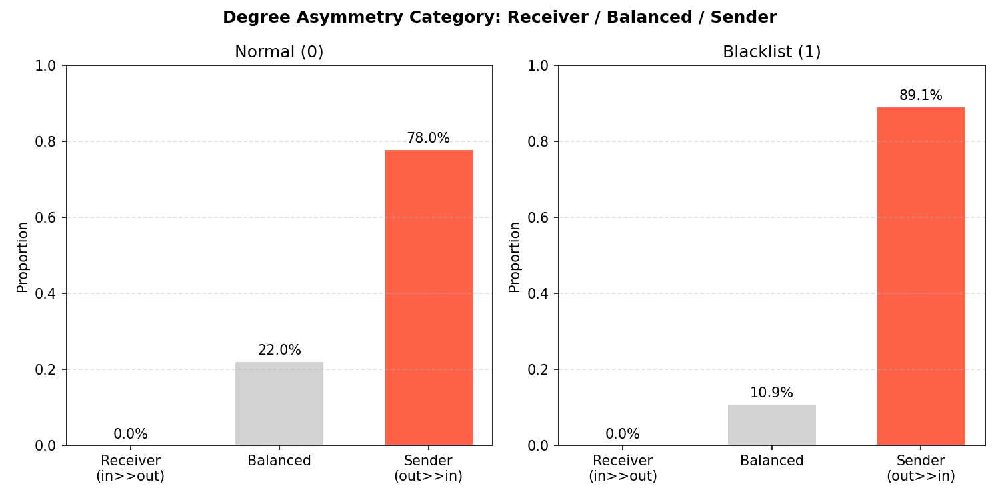
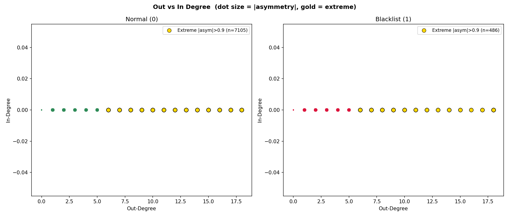

# 圖拓撲分析報告：Degree 與黑白名單關係

## 1. 資料來源與前處理

### 使用資料表

| 資料表 | 說明 |
|---|---|
| `crypto_transfer.csv` | 加密貨幣轉帳紀錄，每筆為一條有向邊 `user_id → relation_user_id` |
| `train_label.csv` | 有標籤的用戶清單，`status=0` 正常，`status=1` 黑名單 |

> 只使用 `train_label.csv` 中有標籤的用戶，排除 `predict_label.csv` 的未知用戶。

### 樣本數

| 類別 | 人數 |
|---|---|
| 正常 (status=0) | 49,377 |
| 黑名單 (status=1) | 1,640 |

### Degree 計算方式

將 `crypto_transfer` 視為有向圖，每筆轉帳為一條有向邊：

```
Out-degree（出度）= 該用戶作為「匯出方」的交易筆數
  out_deg = crypto.groupby("user_id").size()

In-degree（入度）= 該用戶作為「收款方」的交易筆數
  in_deg = crypto.groupby("relation_user_id").size()
```

沒有出現在轉帳紀錄中的用戶，degree 補 0。

---

## 2. 分析一：In-degree / Out-degree 與黑白名單的關係

### 描述統計

| 指標 | 黑名單 out | 黑名單 in | 正常 out | 正常 in |
|---|---|---|---|---|
| mean | 7.1 | 0.3 | 3.7 | 0.1 |
| median | 3.0 | 0.0 | 2.0 | 0.0 |
| 75th pct | 7.0 | 0.0 | 4.0 | 0.0 |
| max | 391 | 55 | 2979 | 37 |

黑名單的 out_degree 平均值（7.1）約為正常用戶（3.7）的兩倍，中位數也更高（3 vs 2）。

### 視覺化

**箱型圖（capped at 90th percentile）**



> 截掉 90th percentile 以上的極端值，讓箱子結構更清晰。黑名單的 out_degree 分布整體偏高，IQR 範圍更寬。

**密度直方圖**



> 黑名單在中高 degree 區間的密度明顯高於正常用戶，尤其 out_degree 差異更顯著。

**Hexbin 密度圖（out vs in）**



> 兩類用戶的點都集中在左下角（低 degree），但黑名單在 out_degree 軸上的分布更分散，有更多高出度的帳戶。

**原始散佈圖**



> 黑名單（紅點）在 out_degree 軸上延伸更遠，部分帳戶有極高的出度但幾乎沒有入度。

---

## 3. 分析二：黑名單帳戶的極端不對稱度數

### 定義：不對稱比（Asymmetry）

```
asym = (out_degree - in_degree) / (out_degree + in_degree)
```

- 範圍：`[-1, +1]`
- `asym ≈ +1`：純匯出帳戶（水房），大量送出資金，幾乎不收款
- `asym ≈ -1`：純匯入帳戶（集資錢包），大量收款，幾乎不匯出
- `asym ≈ 0`：收支對稱的正常交易行為
- 若 `total = 0`（無任何交易），`asym = 0`

### 統計結果

| 指標 | 黑名單 | 正常 |
|---|---|---|
| mean asym | 0.889 | 0.780 |
| median asym | 1.000 | 1.000 |
| \|asym\| > 0.8 的比例 | **87.5%** | 77.3% |

黑名單中有 87.5% 的帳戶 `|asym| > 0.8`，比正常用戶（77.3%）高出 10 個百分點。中位數為 1.0，代表超過一半的黑名單帳戶是「純匯出」型態。

### 視覺化

**不對稱比分布直方圖**



> 黑名單（紅）在 `asym = +1` 的峰值更高更集中，正常用戶（綠）分布相對較平。

**|asym| 箱型圖**



> 黑名單的 |asym| 中位數為 1.0，Q1 也接近 1.0，代表大多數黑名單帳戶幾乎是單向交易。

**三分類比例（Receiver / Balanced / Sender）**



> 將 asym 分為三區間：
> - Sender（out >> in，asym > 0.5）
> - Balanced（-0.5 ≤ asym ≤ 0.5）
> - Receiver（in >> out，asym < -0.5）
>
> 黑名單中 Sender 比例明顯高於正常用戶。

**極端不對稱點散佈圖（金色 = |asym| > 0.9 且 total > 5）**



> 金色點為極端不對稱帳戶。黑名單中這類帳戶更集中在 out_degree 軸上（高出度、低入度），符合水房行為特徵。

---

## 4. 結論

| 觀察 | 說明 |
|---|---|
| 黑名單 out_degree 較高 | 平均出度為正常用戶的 1.9 倍，中位數也更高 |
| 黑名單不對稱比更極端 | 87.5% 的黑名單 \|asym\| > 0.8，以純匯出型為主 |
| 水房特徵明顯 | 大量黑名單帳戶 asym ≈ +1，符合「只送出、不收款」的水房行為 |
| in_degree 差異較小 | 兩類用戶的入度都偏低，但黑名單仍略高 |

---

## 5. 可用於分類的模型建議

基於以上特徵（out_degree、in_degree、asym、total），可考慮以下方向：

### 傳統機器學習（推薦優先嘗試）

| 模型 | 理由 |
|---|---|
| **LightGBM / XGBoost** | 對不平衡資料（1640 vs 49377）處理能力強，可直接使用 `scale_pos_weight`；特徵重要性可解釋 |
| **Random Forest** | 對 degree 這類右偏分布特徵不需要正規化，穩健性高 |
| **Logistic Regression** | 作為 baseline，搭配 log 轉換特徵（`log1p(out_degree)`）效果不錯 |

### 圖神經網路（進階）

| 模型 | 理由 |
|---|---|
| **GCN / GraphSAGE** | 可利用整個交易圖的鄰居資訊，不只看單一節點的 degree，能捕捉「周圍都是黑名單」的結構特徵 |
| **GAT（Graph Attention Network）** | 對不同鄰居給予不同權重，適合交易圖中重要性差異大的場景 |

### 特徵工程建議

在 degree 基礎上可額外加入：
- `log1p(out_degree)`、`log1p(in_degree)`：壓縮右偏分布
- `asym`：不對稱比（本報告定義）
- `total`：總交易次數
- 交易金額的統計量（mean、std、max）
- 時間特徵（交易集中度、活躍天數）

### 不平衡處理

資料比例約 1:30（黑名單:正常），建議：
- `SMOTE` 過採樣黑名單
- 或調整 `class_weight` / `scale_pos_weight`
- 評估指標用 **F1-score（macro）** 或 **AUC-PR**，不要只看 Accuracy
